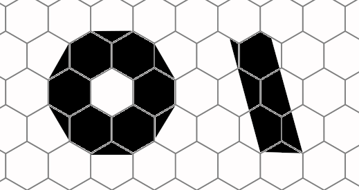

# hexpict

hexpict is tools for converting PNG images to H6P-format of
hexagonal graphic and backward.

## Story of the project (@Story)

It all started when I became interested in hexagonal pixels.
Indeed, why shouldn't pixels be not hexagonal, but square?

After scouring the Internet, I found some interest in the topic,
but a complete lack of tools for creating hexagonal pixel art.

And so I wanted to see hexagonal pixel art,
but there was nothing except for one single game.

I started digging in this direction. But the first, that I found,
straight vertical lines are not possible in hexagonal pixel art.
And I decided to improve the idea by adding subpixel information.
Now the hexagonal pixel actually has 2 colors.
The base color and a secondary that has a certain shape (@H6PMask).

As a result, straight lines in as many as 12 directions
(every 15 degrees) are possible in my hexagonal pixel art.

E.g. circle with 1.5 hexpixels radius and line with a 15 degree slope:

This project is not yet an editor, but a converter. To be continued.
