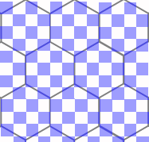

# Введение
Это детальная документация к коду.

Идея детальной документации заключается в том, что всегда
легко объяснить, что делает функция, но чтобы понять как
она это делает нужно знать множество деталей.

Как говорится "дьявол в деталях". В результате мы в коде
описываем только "что делает каждая функция" и расставляем
ссылки на детали в виде @DetailName. А сами детали мы
описываем в директории details.

Каждая ссылка может быть использована несколько раз.
Мы не переводим комментарии, но можем захотеть перевести
детали на несколько языков.

# @Areas
Легко с гиперпикселями большого размера. Однако увеличение
картинки в 8 и более раз не подходит для отображения
хоть сколько-нибудь большого изображения на экране целиком.

Чтобы как-то справится с этой проблемой приходится отдельно
обрабатывать случаи для гиперпикселов размером 3x2.5 и 4x3.5.

Посмотрите на наложение пикселей на гексогональную решётку
в случае размера гиперпикселя 3x2.5:

Каждую чётную строку (при нумерации с 0) гексогон пересекает 11 пикселей
(3x3 плюс совсем немного по одному пикселю сверху и снизу).

Каждую нечётную &mdash; 16 пикселей (4x4).

Аналогично для гиперпикселя 4x3.5:

Тогда каждую чётную строку гексогон пересекает 20 пикселей, однако для
упрощения мы будем рассматривать область 4x6 (24 пикселя).

Каждую нечётную &mdash; 20 других пикселей (4x5).

Чтобы оценить площадь вхождения пикселя в каждую из областей (@HyperMask)
программа берёт гиперпиксель размером 24x28 и прописывает
площадь в пикселях каждой из 50-ти областей в массив areas:

    short[50] areas;

Далее для гиперпикселя 3x2.5 площадь вхождения в одну из областей
прописывается в следующие массивы:

    byte[11][50] pixareas1;
    byte[16][50] pixareas2;

Аналогично для гиперпикселя 4x3.5:

    byte[24][50] pixareas3;
    byte[20][50] pixareas4;

# @AreasChecking
Информация о площадях пикселей в областях сохраняется во временный файл.
При загрузке она проверяется на корректность.

А именно что сумма площадей всех пикселей в каждом из массивов
pixareas1-pixareas4 равна площади области в массиве areas.
