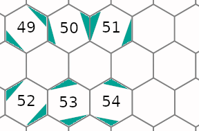
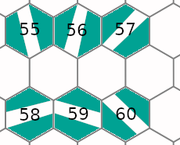
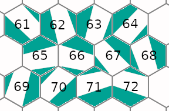
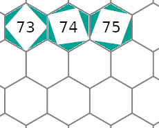
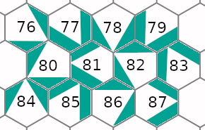
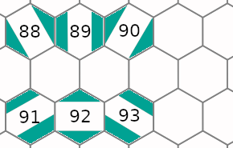
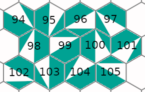
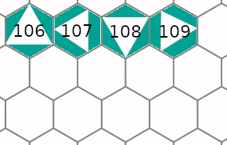

# Введение
Это детальная документация к коду.

Идея детальной документации заключается в том, что всегда
легко объяснить, что делает функция, но чтобы понять как
она это делает нужно знать множество деталей.

Как говорится "дьявол в деталях". В результате мы в коде
описываем только "что делает каждая функция" и расставляем
ссылки на детали в виде @DetailName. А сами детали мы
описываем в директории details.

Каждая ссылка может быть использована несколько раз.
Мы не переводим комментарии, но можем захотеть перевести
детали на несколько языков.

# @H6PFormat
Формат H6P весьма прост и вероятно напомнит BMP.

Все числа хранятся в Big-Endian формате.

Заголовок 4 байта содержит Magic-последовательность "HexP".

Далее 4 байта &mdash; версия формата (=1).

Ещё 4 байта &mdash; ширина (w).

И 4 байта &mdash; высота (h).

Наконец 4\*w\*h байт информация о каждом гексагональном пикселе.

Информация эта состоит из:

18 старших бит &mdash; цвет из оптимальной палитры (@OptimalPalette)

7 следующих бит &mdash; субпиксельная информация, номер формы дополнительного цвета.

7 младших бит &mdash; субпиксельная информация, маска смеси дополнительного цвета.

# @H6PMask
Номер формы дополнительного цвета кодирует одну из 111 возможных форм.

Все формы складываются из от одной до четырёх непересекающихся областей
гиперпикселя (@HyperMask).

Нулевая форма &mdash; это весь гексогон (49-я область) и означает
отсутствие дополнительного цвета.

Формы 1-48 соответствуют областям от 0 до 47.

Формы 49-54 соответствуют областям от 0 до 5 совмещёнными с
параллельными им областям от 6 до 11.

Формы 55-60 соответствуют областям от 24 до 29 совмещёнными с
параллельными им областям от 30 до 35.

Формы 61-72 соответствуют областям от 0 до 11 совмещёнными с
областями от 29 до 28 (после 31-й области идёт 24-я).

Формы 73-75 соответствуют областям от 0 до 2 совмещёнными с
областями от 3 до 5, от 6 до 8 и от 9 до 11.

Формы 76-87 соответствуют областям от 12 до 23
совмещёнными с областями от 16 до 15 (после 23-й области идёт 12-я).

Формы 88-93 соответствуют областям от 12 до 17
совмещёнными с областями от 18 до 23.

Формы 94-105 соответствуют областям 12, 14, 16, 18, 20
совмещёнными с областями из набора 36, 38, 40, 42, 44.

Формы 106-109  соответствуют областям от 12 до 15
совмещёнными с областями 16-19 и 20-23.

Наконец форма 110 соответствует области 48. 

# @HyperMask
В шестиугольном пикселе мы выделяем 50 областей.

Все области сгруппированы по подобию и представлены на
следующих 5 рисунках:

В связи с этим для каждого пикселя гиперпикселя
формируется маска принадлежности каждой области.

Маска пикселя &mdash; это 64-хбитное целое число 50 битов которой
соответствует принадлежности одной из областей.

# @HyperPixel
Гиперпиксель &mdash; это представление гексогонального
пикселя в виде некоторого набора обычных пикселей.

Одно из представлений гиперпикселя можно найти
[здесь](https://en.wikipedia.org/wiki/User:Smcgruer).

Важно, чтобы гиперпиксели укладывались на плоскости
квадратной сетки из обычных пикселей
не оставляя зазоров. В связи с этим не для каждой
ширины удаётся (@HyperPixelSuccess) сгенерировать
симметричный гиперпиксель.

# @HyperPixelSuccess
Итак как было отмечено в @HyperPixel не для каждой
ширины удаётся сгенерировать симметричный гиперпиксель
так чтобы замостить пиксельную сетку без зазоров.

Для проверки отсутствия зазоров мы проверяем поочерёдно
соответствие ширины каждой линии гиперпикселя ширине
пространства между двумя уложенными рядом гиперпикселями.
