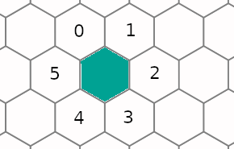

# Введение
Это детальная документация к коду.

Идея детальной документации заключается в том, что всегда
легко объяснить, что делает функция, но чтобы понять как
она это делает нужно знать множество деталей.

Как говорится "дьявол в деталях". В результате мы в коде
описываем только "что делает каждая функция" и расставляем
ссылки на детали в виде @DetailName. А сами детали мы
описываем в директории details.

Каждая ссылка может быть использована несколько раз.
Мы не переводим комментарии, но можем захотеть перевести
детали на несколько языков.

# @Neighbours

Соседние пиксели нумеруются по часовой стрелке как на рисунке:

