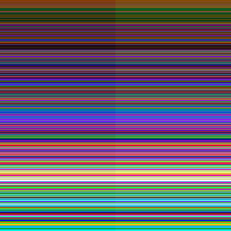

# Введение
Это детальная документация к коду.

Идея детальной документации заключается в том, что всегда
легко объяснить, что делает функция, но чтобы понять как
она это делает нужно знать множество деталей.

Как говорится "дьявол в деталях". В результате мы в коде
описываем только "что делает каждая функция" и расставляем
ссылки на детали в виде @DetailName. А сами детали мы
описываем в директории details.

Каждая ссылка может быть использована несколько раз.
Мы не переводим комментарии, но можем захотеть перевести
детали на несколько языков.

# @OnlyImageColorsMode
Закоментированный код, с которым жалко расставаться.
Служит для выбора цветов только из палитры изобаржения.
Может быть полезно при конвертации пиксель-арта.

# @OptimalPalette
Оптимальная палитра. Изначально предполагалось использовать
всего 12 бит для кодирования цвета пикселя и 12 бит для
субпиксельной информации. Однако 4096 цветов всё же слишком мало.

В результате было решено увеличить число бит на цвет до 20.
И тут начались поиски оптимальной палитры. Поиски привели
меня к цветовой модели ITP. С помощью неё можно сгенерировать
например такую картинку:

На ней много горизонтальных линий, но суть не в них.
Рассмотреть нужно вертикальную линию по центру. Сверху она явная,
а к низу &mdash; исчезающая. Однако если проверить на компьютере,
то разница в цветах слева и справа всюду одинакова &mdash;
15 единиц в одном из RGB каналов.

Это хорошо показывает несовершенство модели RGB и демонстрирует
возможности ITP-модели.

Деля цветовое пространство ITP равномерными кубиками получаем
более оптимальную палитру. К сожалению начиная с 256K цветов для
равномерного распределения модель хочет по нескольку оттенков
таких цветов как RGB(61, 32, 40), RGB(103, 58, 77)
(баклажановые цвета). Поэтому было решено остановится на палитре в
2^18 цветов, тем более что по параметру максимальная цветовая
разница между двумя ближайшими цветами она приближается к
3-хмиллионной неоптимизированной палитре.

Чтобы не быть голословным приведу несколько больше цифр.
Обычная RGB-палитра на 256K цветов имеет минимальную разницу
между соседними цветами в точке RGB(255, 0, 255) (розовый)
равную 0.0138802, а максимальную в точке RGB(106, 0, 127) (баклажановый)
равную 20.1832.

Тогда как оптимальная ITP-палитра имеет минимальную разницу
между соседними цветами в точке RGB(89, 44, 9) (тёмно-коричневый)
равную 1.04128, а максимальную в точке RGB(84, 55, 110) (сиреневый)
равную 10.3239. Таким образом картинку вроде той что выше построить
на ней можно, но не столь убедительно.

Сузив число бит на цвет до 18 пикселей, мы освободили 2 бита, которые
впоследствии успешно расширили субпиксельной информацией.
