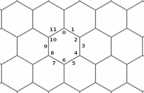

# Введение
Это детальная документация к коду.

Идея детальной документации заключается в том, что всегда
легко объяснить, что делает функция, но чтобы понять как
она это делает нужно знать множество деталей.

Как говорится "дьявол в деталях". В результате мы в коде
описываем только "что делает каждая функция" и расставляем
ссылки на детали в виде @DetailName. А сами детали мы
описываем в директории details.

Каждая ссылка может быть использована несколько раз.
Мы не переводим комментарии, но можем захотеть перевести
детали на несколько языков.

# @PixArea
В @Areas вы познакомились с массивами pixareas1-pixareas4
описывающими области (@HyperMask) для гиперпикселей шириной 3 и 4.

Однако чтобы из областей получить формы (@H6PMask), необходимо
сложить несколько чисел (это можно сделать, т.к. все области
в формах не пересекаются) из массивов pixareas1-pixareas4.

Для хранения информации о форме формируется массив pixarea.

# @PointsOfHexagon
У шестиугольника мы выделяем 12 точек, в точности
как у циферблата часов.

Чётные при этом соответствуют вершинам шестиугольника,
а нечётные &mdash; серединам граней.
